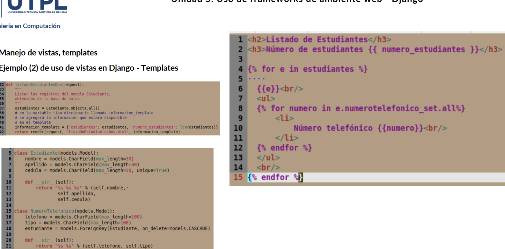

# clase03-2bim

Cuando no existe en la clase que contiene la foreing key un `related_name` para llamar a esa lista de atributos asociados se debe usar `e.[nombre de la clase en minusculas]_set.all` en vez de `e.[related_name].all`

### 25 junio 2025

En el ejemplo 5, dentro de la aplicacion `administrativo` se puede observar lo que es la integridad de datos aplicada a los diferentes formularios.
Para entender esto, se debe tener contexto de que un Estudiante puede tener uno o varios Telefonos, y un Telefono puede pertenecer a UN solo estudiantes. Por ende dentro de la clase o modelo NumeroTelefonico se crea un atributo llamado estudiante, que se le da el "alias" de `numeros_telefonicos`, este alias va a servir para llamar a la lista de numeros telefonicos de un estudiante.

Pasemos a lo que es el index, que es un html simple, en el que se imprimen el estudiante y sus numeros telefonicos asociados. Las funciones que permite por estudiante son la de ver, editar, eliminar y agregar nuevo telefono asociado al estudiante. Ademas por numero telefonico se permite su edicion.

Finalmente se tiene dos botones que permiten agregar un numero de telefono o un estudiante. 

Lo interesante esta en el formulario de creacion de numero telefonico, cada uno es diferente, pues cada uno protege la integridad de los datos dependiendo del contexto. Aquel formulario que se accede a traves del `+Telefono` cuida su integridad utilizando un componente de estudiante escondido, ademas de no dejar que el usuario asociado al telefono cambie. En cambio, el formulario que se accede a traves de `agregar telefono` permite crear un numero telefonico, siempre y cuando este asociado a un estudiante ya creado, protegiendo de igual forma la inetgridad de los datos. 

Ambos formularios son "controlados" en forms.py (`NumeroTelefonicoForm` y `NumeroTelefonicoEstudianteForm`) y en views (`crear_numero_telefonico` y `crear_numero_telefonico_estudiante`)